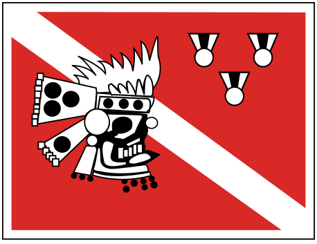
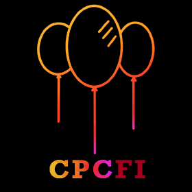
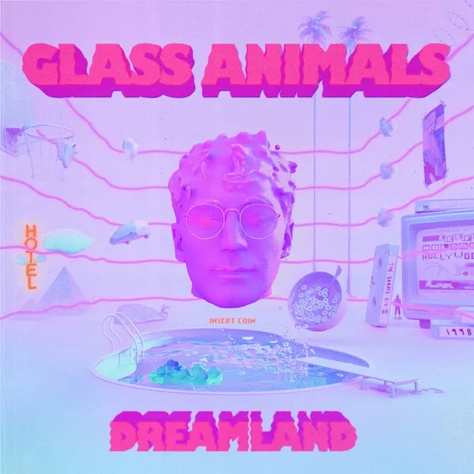
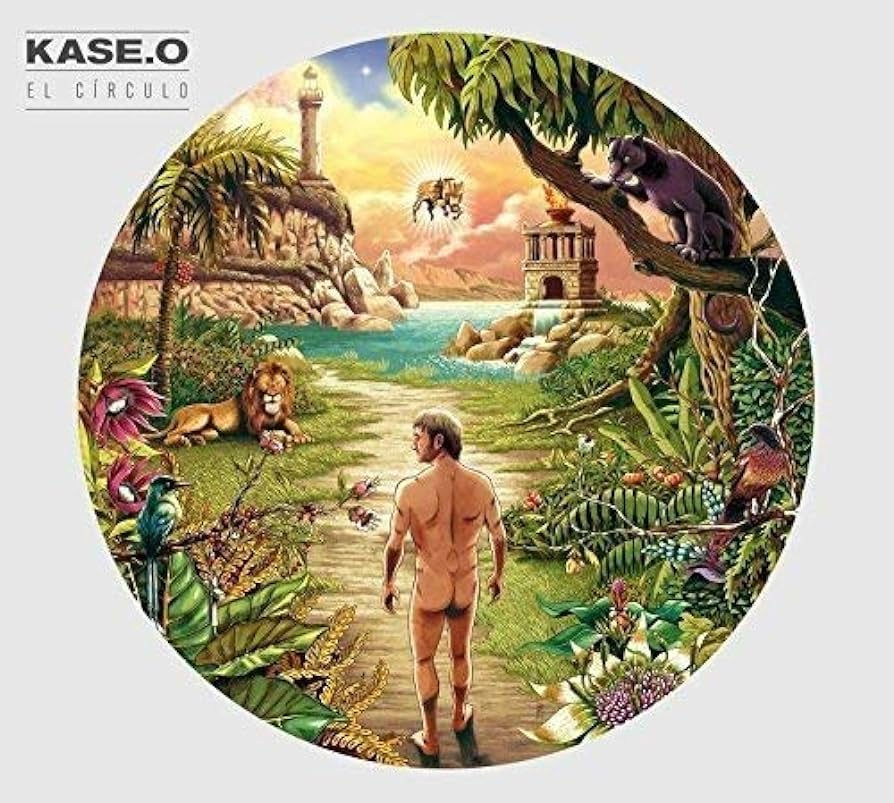

    
    

<h1 align="center"> 🟩 AndrésTG 🟫</h1>

 
  Computer Engineering Student
   
  Future Data Scientist?
   
  UNAM

 

 
<h2> Nice to see you here ✨</h2>

<ul>
  <li> I'm 20 years old 👦🏻 </li>
  <li> I'm from Mexico City 🌮 </li>
  <li> I'm a competitive programmer 🎈 </li>
  <li> I'm a scuba diver and I like to practice freediving 🐋 </li>
  <li> Every plan is a good plan : 🏀🎱⛸️🚴🏻‍♂️🎳 </li>
  <li> I like online chess♟️ </li>
  <li> I enjoy every music genre 🎧 </li>
  <li> I love Italian, Mexican and Japanese cuisines 🍝</li>
  <li> My record in rubik's cube is 9.94s 🧩</li>
</ul>

 
<h2> 📚 Coding skills 👾</h2>

  
  
  

 
<h2> This two love to take away my free time 😭</h2>

  
  

 
<h2> 🎧 Mira chavito, estos son álbumes pero de los GOD 🎧 (Music Taste)</h2>

  
  
  
  

 
<h2> Soy ese 🦆 (Literally Me) </h2>

   
  

 
<h2> Naughty Dog Enjoyer 🐾 </h2>

    
  

 

 Thanks for passing by ğŸ 

  

